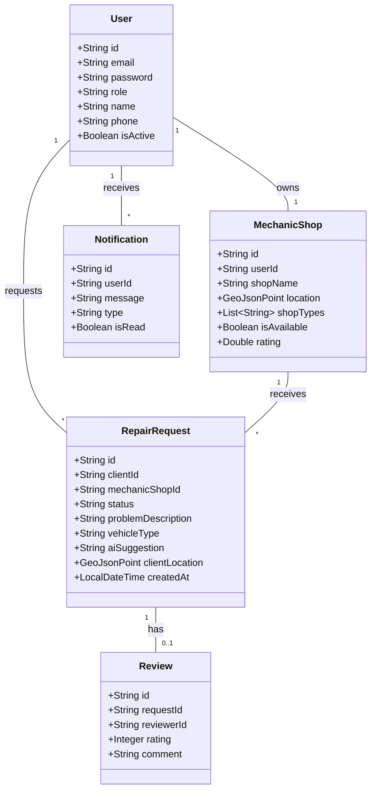
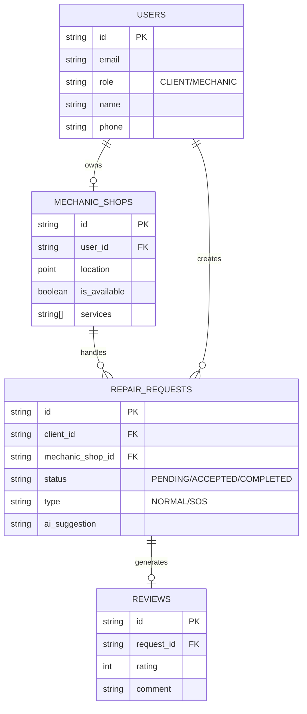
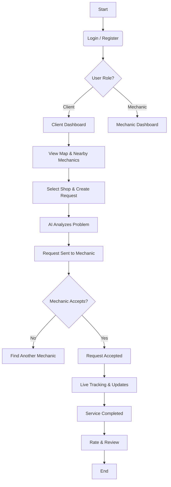

# 🚗 PitShop Mechanix

> **Your Reliable Roadside Assistant.**  
> _Connecting stranded drivers with nearby mechanics in real-time._

---

## 🌟 Project Overview (STAR Method)

We have approached this project using the **STAR** (Situation, Task, Action, Result) method to clearly define our objectives and outcomes.

### **S - Situation**

Vehicle breakdowns are unpredictable, stressful, and often happen in unfamiliar locations. Drivers frequently struggle to find reliable help quickly, leading to:

- **Safety Risks**: Stranded on highways or remote areas.
- **Time Loss**: Calling multiple shops to check availability.
- **Uncertainty**: Lack of transparency regarding mechanic location and arrival time.
- **Trust Issues**: Finding verified and rated mechanics.

### **T - Task**

Our goal was to build a comprehensive **On-Demand Roadside Assistance Platform** that:

1.  **Instantly connects** users with the nearest available mechanics.
2.  Provides **real-time tracking** of the mechanic's location.
3.  Offers an **SOS feature** for immediate emergency response.
4.  Includes **AI-powered diagnostics** to help users understand their vehicle's issue before the mechanic arrives.
5.  Ensures a seamless experience for both **Clients** (Drivers) and **Service Providers** (Mechanics).

### **A - Action**

We engineered a robust full-stack solution using modern technologies:

- **Backend**: Built with **Java Spring Boot** for scalability and performance. We utilized **MongoDB** for its flexibility with schema-less data and powerful geospatial querying capabilities (`$near`, `$geoNear`) to find mechanics within a specific radius.
- **Frontend**: Developed a responsive SPA (Single Page Application) using **React.js** and **Vite**. The UI is styled with **Tailwind CSS** and **Shadcn/UI** for a premium, accessible look.
- **Real-Time Features**: Implemented **WebSockets (STOMP/SockJS)** to enable live request updates and mechanic tracking on the map.
- **Mapping**: Integrated **Leaflet Maps** (React-Leaflet) to display user location and mechanic shops dynamically.
- **AI Integration**: Incorporated **Google Gemini AI** to analyze user-reported problems and provide preliminary suggestions/diagnostics.
- **Security**: Secured the platform using **JWT (JSON Web Tokens)** Authentication and strictly typed interfaces with TypeScript.

### **R - Result**

The result is **PitShop Mechanix**, a fully functional, production-ready application where:

- Users can **visualize nearby mechanics** on an interactive map.
- Requests are **broadcasted instantly** to relevant providers.
- Mechanics can **manage their availability** and accept jobs via a dedicated dashboard.
- The entire service lifecycle—from request to completion and rating—is **digitized and transparent**.

---

## 📊 System Architecture & Diagrams

### 1. Class Diagram

This diagram illustrates the core object-oriented structure of our backend, highlighting the relationships between Users, Shops, and Requests.



### 2. Entity Relationship (ER) Diagram

A visual representation of the database schema and how data entities relate to one another within MongoDB.



### 3. User Flow Diagram (Standard Request)

The journey of a user from logging in to getting their vehicle fixed.



---

## 📖 Detailed Project Explanation

### 🏗️ 1. Core Modules

#### **A. User Management & Authentication**

- **Secure Access**: We use **JWT (JSON Web Tokens)** to secure API endpoints. Upon login, a token is issued and stored (typically in localStorage/cookies) to authenticate subsequent requests.
- **Role-Based Access Control (RBAC)**: The system distinguishes between:
  - **Clients**: Can search for mechanics and make requests.
  - **Mechanics**: Can manage their shop profile, set availability, and accept requests.
  - **Admins**: System oversight (optional implementation).

#### **B. Geospatial Mechanics Locator**

- **The Engine**: Leveraging **MongoDB's `2dsphere` index**, we perform high-performance geospatial queries.
- **Logic**: When a client opens the map, the backend calculates the distance between the client's coordinates and all active mechanic shops, returning a sorted list of the nearest providers.
- **User Interface**: Users see custom markers on a **Leaflet** map, differentiating between their location and available shops.

#### **C. The Repair Request Lifecycle**

The heart of the application is the `RepairRequest` entity. It moves through a state machine:

1.  **PENDING**: Created by client, awaiting mechanic response.
2.  **ACCEPTED**: Mechanic has confirmed the job.
3.  **IN_PROGRESS**: Mechanic has arrived or is working.
4.  **COMPLETED**: Work is done.
5.  **CANCELLED/EXPIRED**: If no action is taken.

#### **D. AI-Powered Assistant**

- **Integration**: We integrated **Google Gemini AI**.
- **Function**: When a user describes their car trouble (e.g., "White smoke from engine"), the prompt is sent to the AI service. The AI returns a **probable diagnosis** and **suggested actions**, which are saved with the request. This helps the mechanic prepare with the right tools before arriving.

#### **E. Real-Time Communication**

- **WebSockets**: Using `SockJS` and `STOMP`, the app establishes a persistent connection.
- **Usage**:
  - **Instant Notifications**: Mechanics get a pop-up instantly when a request is made nearby.
  - **Status Updates**: Clients see the status change (e.g., "Mechanic is on the way") without refreshing the page.

---

## 🛠️ Technology Stack

### **Frontend (Client Side)**

- **Framework**: React.js (Vite Bundle)
- **Language**: TypeScript (for strict type safety)
- **Styling**: Tailwind CSS, Shadcn/UI, Lucide React (Icons)
- **State Management**: Redux Toolkit & React Query
- **Maps**: React Leaflet & Leaflet CSS
- **Forms**: React Hook Form + Zod Validation

### **Backend (Server Side)**

- **Framework**: Spring Boot 3.x (Java)
- **Database**: MongoDB (NoSQL)
- **Security**: Spring Security + JWT
- **Real-time**: Spring WebSocket (STOMP)
- **AI**: Spring AI / Google Gemini Integration
- **Build Tool**: Maven

---

## 🚀 Getting Started

### 1. Prerequisites

- Java JDK 17+
- Node.js 18+
- MongoDB (Local or Atlas)
- Maven

### 2. Backend Setup

```bash
cd backend
# Create a .env file based on example
# Insert your MongoDB URI, JWT Secret, and Gemini API Key
mvn spring-boot:run
```

### 3. Frontend Setup

```bash
cd frontend
npm install
# Create a .env file
# VITE_API_URL=http://localhost:8080
npm run dev
```

---

## 📷 Screenshots

_(Add screenshots of your Dashboard, Map View, and Mobile Interface here)_

---

## 🤝 Contribution

1.  Fork the repository.
2.  Create a feature branch (`git checkout -b feature/NewFeature`).
3.  Commit your changes.
4.  Push to the branch.
5.  Open a Pull Request.

---

> **PitShop Mechanix** — _Driving the future of roadside assistance._
